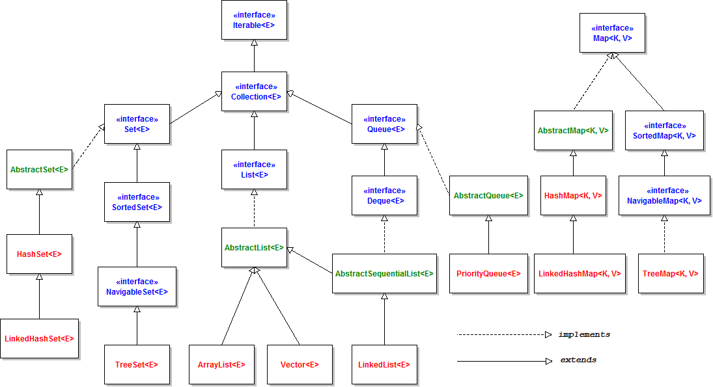

# GUIA COMPLETA: ELS MAPS A JAVA



---

## 1. Introducció: Què és un Map?
Fins ara hem utilitzat llistes (`ArrayList`, `LinkedList`) on cada element té una posició o índex (0, 1, 2...). Un **Map** és una estructura que guarda parelles de **Clau-Valor (Key-Value)**.

* **Clau (Key):** És l'identificador únic (com un DNI o un codi de barres). No es pot repetir.
* **Valor (Value):** És la dada associada a la clau. Es pot repetir.

> **Exemple:** En un diccionari, la paraula és la *Clau* i la definició és el *Valor*.

---

## 2. Tipus de Maps (Implementacions)


A Java, segons com vulguem gestionar l'ordre intern, triarem un d'aquests tres:

1.  **HashMap**: No manté cap ordre. És el més ràpid i eficient.
2.  **LinkedHashMap**: Manté l'ordre segons s'han anat introduint les dades (ordre d'inserció).
3.  **TreeMap**: Manté les dades ordenades segons el valor de la clau (alfabèticament o numèricament).

---

## 3. Mètodes imprescindibles (La caixa d'eines)

Suposem que tenim: `Map<String, Integer> inventari = new HashMap<>();`

| Mètode | Descripció | Exemple |
| :--- | :--- | :--- |
| **`put(clau, valor)`** | Afegeix una parella o actualitza el valor si la clau ja existeix. | `inventari.put("Pomes", 50);` |
| **`get(clau)`** | Retorna el valor de la clau. Si no existeix, retorna `null`. | `inventari.get("Pomes"); // 50` |
| **`containsKey(clau)`** | Comprova si una clau existeix (`true/false`). | `inventari.containsKey("Pomes");` |
| **`remove(clau)`** | Elimina la parella sencera mitjançant la clau. | `inventari.remove("Pomes");` |
| **`size()`** | Ens diu quantes parelles hi ha al mapa. | `inventari.size();` |

### Com recórrer un Map (Iteració)
Com que no podem utilitzar un `for` amb índex `i`, utilitzem el mètode `entrySet()` per obtenir totes les parelles:

```java

// Opció 1: Utilitzant un Iterator (Forma clàssica)
System.out.println("Iterating a Map using an iterator:");

Set<Map.Entry<String, Integer>> set = items.entrySet();
Iterator<Map.Entry<String, Integer>> iter = set.iterator();

while (iter.hasNext()) {
    Map.Entry<String, Integer> entry = iter.next();
    String key = entry.getKey();
    Integer value = entry.getValue();
    System.out.println("[ Key: " + key + " ] [ Value: " + value + " ]");
}

// Opció 2: Obtenir el Set de claus i recórrer-lo
// (Més llegible, però fa un .get() extra per cada element)
Set<String> keys = items.keySet();

for (String key : keys) {
    Integer value = items.get(key);
    System.out.println("[ Key: " + key + " ] [ Value: " + value + " ]");
}

// Opció 3: Utilitzant el bucle for-each (La més recomanada per llegibilitat/eficiència)
System.out.println("Iterating a Map using a foreach loop:");
for (Map.Entry<String, Integer> entry : items.entrySet()) {
    System.out.println("[ Key: " + entry.getKey() + " ][ Value: " + entry.getValue() + " ]");
}
```

---


## 3. Taula Comparativa

| Característica | **HashMap** | **LinkedHashMap** | **TreeMap** |
| :--- | :--- | :--- | :--- |
| **Ordre intern** | Cap (caòtic) | Per inserció | Per valor de clau (A-Z) |
| **Velocitat** | Molt ràpida | Ràpida | Mitjana ($O(\log n)$) |
| **Permet nulls?** | Sí | Sí | No a les claus |

---

## 4. Exercicis per als alumnes

### Exercici 1: El Magatzem de Logística
Una empresa rep paquets. Cada paquet té un **Codi de Barres** (String) i un **Producte** (String). L'empresa vol imprimir la llista i que els paquets surtin en el mateix ordre en què han arribat.

1.  Crea el Map adequat segons la teoria.
2.  Afegeix: `"P01" -> "Monitor"`, `"P02" -> "Teclat"`, `"P03" -> "Ratolí"`.
3.  Imprimeix el Map. Què observes?

### Exercici 2: L'Agenda Automàtica
Volem guardar contactes. La clau és el **Nom** i el valor és el **Telèfon**. L'usuari vol que l'agenda estigui sempre ordenada alfabèticament sense fer servir cap mètode `sort()`.

1.  Crea el Map adequat segons la teoria.
2.  Afegeix: `"Zaira"`, `"Albert"` i `"Berta"`.
3.  Mostra el resultat. Què passa si fas un `.put()` sobre `"Albert"` amb un telèfon nou?

### Exercici 3: El Comptador de Paraules (Repte de lògica)
Donada la següent llista, compta quantes vegades apareix cada fruita:  
`"poma", "pera", "poma", "plàtan", "poma", "pera"`

1.  Quin seria el map segons la teoria més adequat.
   
**Codi per completar:**
```java
List<String> fruites = Arrays.asList("poma", "pera", "poma", "plàtan", "poma", "pera");
Map<String, Integer> comptador = new HashMap<>();

for (String f : fruites) {
    // Si la fruita ja està al map, suma-li 1 al valor actual
    // Si no hi és, afegeix-la amb valor 1
}
System.out.println(comptador);
